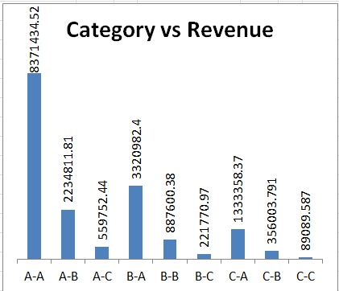
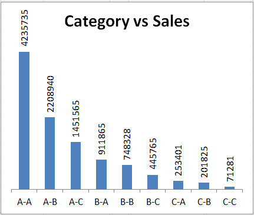

# ABC Analysis & Multi-Criteria ABC Analysis  

## 📌 Project Overview  
This project demonstrates **inventory segmentation** using **ABC Analysis** and **Multi-Criteria ABC Analysis** techniques.  
The goal is to classify and prioritize items based on their business impact (sales/revenue and other factors), enabling organizations to make **data-driven inventory and procurement decisions**.  

Segmentation helps in answering key questions like:  
- Which SKUs drive the majority of revenue?  
- Which items are critical despite low sales?  
- How to balance holding cost vs. service level?  

---

## 📂 Files Included  
- [ABC & Multi criteria ABC analysis.xlsx](ABC%20&%20Multi%20criteria%20ABC%20analysis.xlsx) → Excel file containing raw data and analysis.  
- `visuals/` → Folder containing charts and output images.  

  
  

  

---

## 🔑 Methodology  

### 1. **Segmentation**  
- The dataset of SKUs was extracted with details on **sales, revenue, and other business factors**.  
- Segmentation provides the foundation to focus on the most important items.  

### 2. **ABC Analysis (by Sales/Revenue)**  
- Items were ranked in descending order of **sales contribution**.  
- **Pareto principle applied**:  
  - **A-class** → Top ~70–80% of cumulative sales value (high priority).  
  - **B-class** → Next ~15–20%.  
  - **C-class** → Remaining ~5–10% (low impact).  

👉 This identified the **few items driving majority of sales**.  

### 3. **Multi-Criteria ABC Analysis**  
- Sales alone cannot capture **business-criticality**.  
- Added **other factors** such as:  
  - **Revenue** contribution.  
  - **Lead Time** (longer lead = higher importance).  
  - **Stock-out Risk** / **Criticality score**.  
- Used **weighted scoring** to rank items more holistically.  

👉 This ensured that even **low-sales but high-critical items** were prioritized.  

---

## 📊 Business Impact  
- **Improved Inventory Focus** → Concentrated on A-class and critical items.  
- **Optimized Holding Cost** → Avoided overstocking low-value C-class SKUs.  
- **Enhanced Supplier Strategy** → Prioritized suppliers of A-class & critical SKUs.  
- **Risk Mitigation** → Prevented stockouts of high-criticality items.  

---

## 🚀 How to Use  
1. Open the Excel file → [ABC & Multi criteria ABC analysis.xlsx](ABC%20&%20Multi%20criteria%20ABC%20analysis.xlsx).  
2. Explore:  
   - **ABC sheet** → Sales-based classification.  
   - **Multi-Criteria sheet** → Weighted scoring analysis.  
3. Check charts inside `visuals/` or embedded above for graphical interpretation.  
4. Apply the framework to your own dataset by adjusting weights and criteria.  

---

## 📌 Example Insights  
- In the dataset, **20% of SKUs contributed ~80% of sales (A-class)**.  
- However, multi-criteria analysis showed **some B/C items were critical due to long lead times**, requiring higher attention than pure sales ranking suggested.  

---

✍️ *This project showcases how simple ABC can evolve into **data-driven multi-criteria prioritization**, improving both efficiency and resilience in supply chain planning.*  
