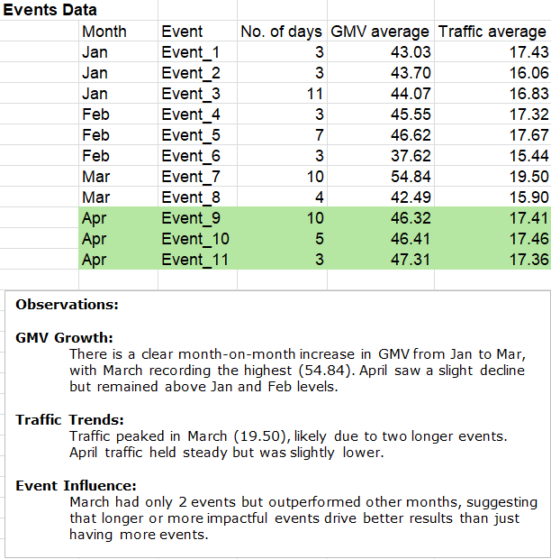
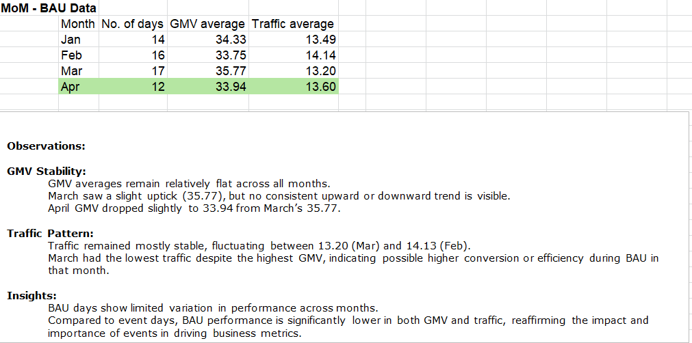

# 📈 Demand Planning & Forecasting

## 📌 Project Overview
This project demonstrates **Demand Planning and Forecasting** using historical sales data.  
The analysis focuses on
- Exploratory Data Analysis (EDA)
- Trend Analysis
- Regression Modeling
to forecast traffic and GMV (Gross Merchandise Value).  

The goal is to build a structured forecasting framework that improves
- Accuracy
- Demand visibility
- Planning efficiency

---

## 📂 Files Included  
- [ABC & Multi criteria ABC analysis.xlsx](ABC%20&%20Multi%20criteria%20ABC%20analysis.xlsx) → Excel file containing raw data and analysis.  
- `visuals/` → Folder containing charts and output images.  

  

  
  

  

 

---

# Sales Forecasting – GMV & Traffic Analysis  

This project applies **multiple regression modeling** to forecast April’s GMV (Gross Merchandise Value) and Traffic, incorporating event tags, weekdays, and historical traffic trends.  

---

## Methodology  

- The forecasting approach is based on a **Multiple Regression Model**.  
- Regression helps in identifying the relationship between dependent (GMV/Traffic) and independent variables (events, weekdays, past traffic).  
- The model first predicts **April Traffic** using event and weekday features, and then uses predicted traffic along with other variables to estimate **April GMV**.  
- This method allows separation of **Business-as-Usual (BAU)** performance from **Event-driven** performance.  

---

## Data Preparation & Feature Engineering  

To build the regression-ready dataset in Excel, the following steps were performed:  

- **One-Hot Encoding**  
  - Created additional columns for **days of the week** (Mon–Sun) to capture weekday patterns.  
  - Created binary event tag columns to differentiate **Event Days vs BAU Days**.  

- **Feature Scaling**  
  - Normalized/standardized traffic-related columns where necessary to make regression more stable.  

- **Feature Selection**  
  - Selected predictors like **event tags, weekdays, and historical traffic** that showed strong correlation with GMV.  
  - Removed redundant variables to avoid multicollinearity.  

These preprocessing steps improved interpretability and ensured the regression model could capture traffic and event effects effectively.  

---

## Contents

The Excel file contains the following sheets:  

1. **Given Data** – Raw GMV & Traffic data.  
2. **EDA** – Event-wise & BAU summaries with April forecast.  
3. **Trend Line Analysis** – Visualization of GMV & Traffic with event markers, including April forecasts.  
4. **Regression for April_Traffic** – Traffic forecast using event tags & weekday variables.  
5. **Regression for April_GMV** – GMV forecast based on predicted traffic (from Sheet 4) & additional predictors.  

---

## 📊 Business Impact
- Improved **forecast accuracy** for demand planning.  
- Enabled better **inventory & capacity planning**.  
- Reduced **stock-outs and overstocking risk**.  
- Provided a structured approach to **data-driven decision-making**.  

---

## 🚀 How to Use
1. Download the Excel file.  
2. Open the sheets in order: `Given Data → EDA → Trend line → Regression`.  
3. Review forecasting outputs in the regression sheets.  
4. Apply the same framework to your own demand dataset.  

---

## 🏆 Key Learnings
- Importance of **data cleaning & EDA** in forecasting.  
- How regression models improve **demand predictability**.  
- Practical application of forecasting for **demand planning, inventory optimization, and capacity management**.  

---

## 🔮 Future Improvements
- Automate forecasting with **Python (scikit-learn / statsmodels)**.  
- Incorporate **time-series methods (ARIMA, Prophet, LSTM)**.  
- Add **visual dashboards** in Power BI/Tableau for business users.  

---
